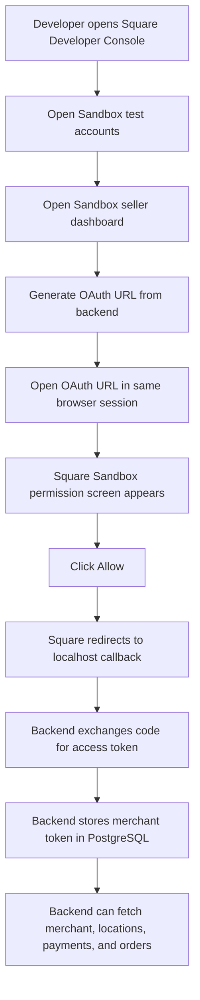
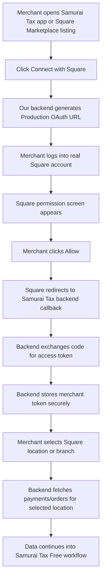

# Square OAuth Sandbox Error Log

This note records the specific OAuth issue we faced, why it happened, how we solved it, and how Sandbox flow differs from Production flow.

---

## 1. Error We Faced

When opening the Square Sandbox OAuth URL directly, the browser showed a blank page or a `400` error.

Example problematic URL:

```txt
https://app.squareupsandbox.com/oauth2/authorize?client_id=sandbox-sq0idb-kKomrQEtWJz5CY3ysiDtPA&scope=MERCHANT_PROFILE_READ+PAYMENTS_READ+ORDERS_READ&session=false&state=kBUap1KdipOBmidpe22i-7lyEZ9HQaBw8gABo8i7s8A%22,%22state%22:%22kBUap1KdipOBmidpe22i-7lyEZ9HQaBw8gABo8i7s8A%22}
```

The browser developer console showed failed resource loading / `400` errors.

---

## 2. What Was Wrong With That URL

There were two important problems.

### Problem 1: Wrong OAuth domain

The safer/correct Sandbox OAuth authorization URL we generated from the backend was:

```txt
https://connect.squareupsandbox.com/oauth2/authorize
```

But the problematic URL used:

```txt
https://app.squareupsandbox.com/oauth2/authorize
```

For our backend test, we should use the backend-generated `auth_url` that starts with:

```txt
https://connect.squareupsandbox.com/oauth2/authorize
```

---

### Problem 2: The `state` value was malformed

The problematic URL ended like this:

```txt
&state=kBUap1KdipOBmidpe22i-7lyEZ9HQaBw8gABo8i7s8A%22,%22state%22:%22kBUap1KdipOBmidpe22i-7lyEZ9HQaBw8gABo8i7s8A%22}
```

This looks like part of a JSON response was accidentally copied into the URL.

A correct OAuth URL should look like this:

```txt
https://connect.squareupsandbox.com/oauth2/authorize?client_id=sandbox-sq0idb-xxxxxxxx&scope=MERCHANT_PROFILE_READ+PAYMENTS_READ+ORDERS_READ&state=RANDOM_STATE_VALUE
```

The `state` should be just one random value, for example:

```txt
state=kBUap1KdipOBmidpe22i-7lyEZ9HQaBw8gABo8i7s8A
```

It should not include this:

```txt
%22,%22state%22:%22...%22}
```

---

## 3. What Also Confused Us: `session=false`

Our OAuth URL previously had:

```txt
session=false
```

In Sandbox, Square showed a message like:

```txt
While you test in sandbox mode the `session` parameter will not force logout before viewing this screen.
```

This means `session=false` is not useful for forcing a fresh login in Sandbox.

Recommended Sandbox URL parameters:

```txt
client_id
scope
state
```

So in `app/services/square_oauth.py`, this is better:

```python
params = {
    "client_id": settings.SQUARE_APPLICATION_ID,
    "scope": settings.SQUARE_SCOPES,
    "state": state,
}
```

Instead of:

```python
params = {
    "client_id": settings.SQUARE_APPLICATION_ID,
    "scope": settings.SQUARE_SCOPES,
    "session": "false",
    "state": state,
}
```

---

## 4. Why We Needed To Open The Sandbox Dashboard First

In Sandbox testing, the OAuth permission page needs a valid **Sandbox seller session**.

Being logged into the Square Developer Console is not always enough.

The Developer Console account and the Sandbox seller account are different contexts.

So when we opened the OAuth URL directly, Square sometimes did not know which Sandbox seller account should approve the app. This caused the blank page or `400` issue.

The fix was to open the Sandbox test seller dashboard first.

That created the correct Sandbox seller session in the browser.

After that, opening the same OAuth URL showed the correct Square permission screen.

---

## 5. How We Solved It

We used this flow:

```txt
1. Open Square Developer Console
2. Go to Sandbox test accounts
3. Open the Sandbox test seller dashboard
4. In the same browser session, open the backend-generated OAuth URL
5. Square permission screen appears
6. Click Allow
7. Square redirects to our backend callback
```

After doing that, the Square permission page appeared correctly:

```txt
Sandbox test account wants access to your Square Account
- View your merchant profile information
- View your payments history
- View your Square orders
```

Then clicking `Allow` should redirect to:

```txt
http://localhost:8800/api/square/oauth/callback?code=...&state=...
```

---

## 6. Correct Sandbox Flow



Sandbox OAuth test URL should look like:

```txt
https://connect.squareupsandbox.com/oauth2/authorize?client_id=sandbox-sq0idb-xxxxxxxx&scope=MERCHANT_PROFILE_READ+PAYMENTS_READ+ORDERS_READ&state=RANDOM_STATE_VALUE
```

Then callback URL:

```txt
http://localhost:8800/api/square/oauth/callback?code=...&state=...
```

---

## 7. Why Production Does Not Need This Dashboard Step

Production is different.

In Production, the merchant is a real Square seller.

They already have a real Square account and can log in normally from the OAuth page.

Production users do **not** need to open:

```txt
Square Developer Console
Sandbox test accounts
Sandbox seller dashboard
```

Those are only for development/testing.

Production flow is similar to apps like Greenback/Dext Commerce:

```txt
Merchant clicks Connect with Square
→ Square login / permission page opens
→ Merchant clicks Allow
→ Square redirects to our backend
→ Backend stores merchant token
→ App fetches merchant locations and transactions
```

The merchant never sees Sandbox developer tools.

---

## 8. Correct Production Flow



Production OAuth URL will use the Production Square domain and Production app credentials, not Sandbox credentials.

---

## 9. Sandbox vs Production Difference

| Item | Sandbox | Production |
|---|---|---|
| Purpose | Development/testing | Real merchant usage |
| Seller account | Sandbox test seller account | Real Square seller account |
| Need to open developer console? | Yes, often for test setup | No |
| Need to open Sandbox seller dashboard first? | Sometimes yes, to create seller session | No |
| OAuth permission screen | Sandbox permission screen | Real Square permission screen |
| App credentials | Sandbox Application ID / Secret | Production Application ID / Secret |
| Backend callback | Localhost is okay for testing | Real HTTPS backend URL required |
| Example callback | `http://localhost:8800/api/square/oauth/callback` | `https://api.samurai-tax.com/api/square/oauth/callback` |

---

## 10. What To Remember Next Time

If Square Sandbox OAuth shows blank page or `400`:

```txt
1. Do not panic.
2. Confirm the OAuth URL starts with:
   https://connect.squareupsandbox.com/oauth2/authorize
3. Confirm client_id is not empty.
4. Confirm state is clean and not malformed.
5. Open Sandbox test seller dashboard first.
6. Open the OAuth URL in the same browser session.
7. Click Allow.
```

Do not copy the whole JSON response into the browser.

Copy only the value of `auth_url`.

Correct:

```txt
https://connect.squareupsandbox.com/oauth2/authorize?client_id=...&scope=...&state=...
```

Incorrect:

```txt
{"auth_url":"https://connect.squareupsandbox.com/oauth2/authorize?...","state":"..."}
```

---

## 11. Final Conclusion

The issue was not mainly FastAPI, PostgreSQL, Docker, or backend code.

The main cause was the Square Sandbox OAuth browser session.

For Sandbox:

```txt
Open Sandbox seller dashboard first → then open OAuth URL
```

For Production:

```txt
Merchant clicks Connect with Square → logs into Square normally → clicks Allow
```

Production should be simple like Greenback/Dext Commerce and should not require any Sandbox dashboard step.
